# The Self Help Group
The Self Help Group are a band from Brighton, UK. The website is targeted at people who want to know more about the band and discover more of their work. The site includes the video from the latest single and an additional track from the latest album in mp3 format to listen to. Users are encouraged throughout the site to follow the band on social media and streaming platforms, to gain access to further content and purchase music. A photo gallery of live performances can be enjoyed and details of next live show are highlighted so that users can be informed where and when they can next see a show. Users can sign up to the mailing list for more show information, and there is a contact form which can be used for bookings and enquiries.
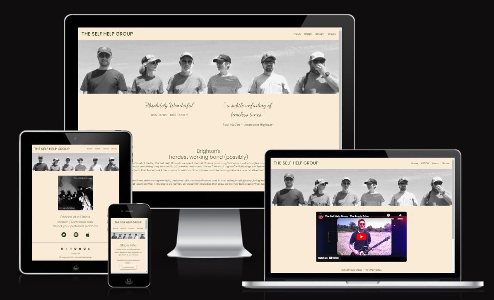
## Features
### Existing Features
- _Navigation Bar_
    - Featured on all pages except the 404 page, the fully responsive navigation bar includes links to the Logo, Home page, Watch page, Stream page and Shows page, and is identical in each page to allow for easy navigation, the active page is highlighted by uppercase lettering in the main menu, when a user hovers over a link it is highlighted with a shadow box, the hover feature is applied to all links site wide for consistent styling and user experience.
    - This section will allow the user to easily navigate from page to page across all devices without having to revert back to the previous page via the ‘back’ button.
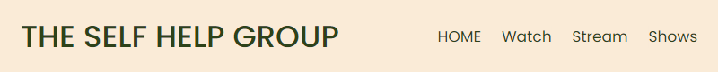
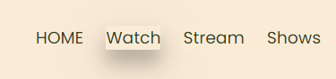
- _Banner Image With Overlay_
    - Featured on all pages except the 404 page, the responsive banner with overlay introduces the user to the band with an eye catching, wide angle, black and white headshot image of the six members, all images site wide are styled black and white to be consistent with the overall two tone theme. There is an overlay when hovering or first tapping on mobile with a callout to stream or download the new album "Dream of a Ghost", with a highlighted link directing the user straight to the stream page. The overlay message and link can be updated, as exampled on the shows page which has details of the next show and a link to the venue website.
    - This feature allows the user to quickly navigate to key parts of the site which may be of key interest. It can be updated with new release details, show dates, merchandise and ticket availability, providing the band with an opportunity to highlight key information to fans and users.

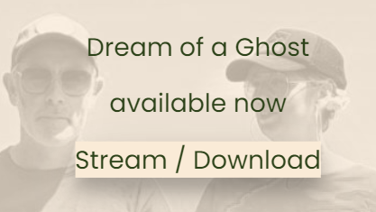
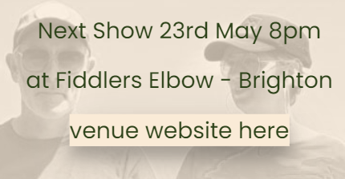
- _Big Quotes_
    - Featured on the main landing page beneath the banner image, fully responsive to smaller screen sizes, these two review quotes catch the users eye in their oversized handwritten font, the first of which is from a very well known and respected BBC Radio 2 DJ, they act as a teaser on mobile screens to encourage the user to scroll down and discover the additional content below, and act as a callout to the quality of the music produced.
    - This feature draws the user in to the page and informs them about the quality of the bands music, heightening the sense of excitement about what they may experience online or at a live show
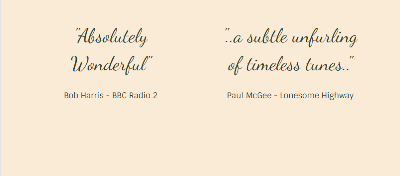
- _History_
    - Featured on the landing page, this section contains a brief tongue-in-cheek band history and a selection of review quotes from across the years.
    - This feature will give the user a sense of who the band are and what to expect when they hear their music, hopefully encouraging them to seek out more content
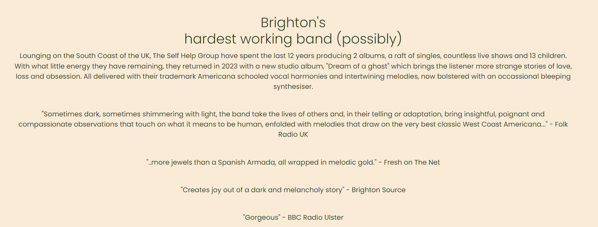
- _Footer_
    - Featured on all pages except the 404 page, the footer is separated from the main page body by a bold line, it contains links to the bands landing pages on various social media and streaming sites in the form of site brand icons, which are all reactive to hover with the site wide hover shadow feature, and further accentuated with a subtle font size increase. Below these is a link to the contact form, and then finally copyright information on the bottom line.
    - This feature enables the user to discover further content on external sites and interact with the band on their social media pages. The contact form enables users who wish to make enquiries about bookings or use of content to get in touch.
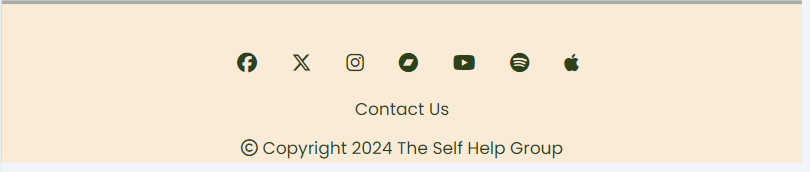
- _Video Player_
    - Featured on the watch page, this embeded Youtube video player is responsive to screen size and can be used in full screen mode. It is pre loaded with the video from the latest single, the user has full control over playback. Below is a large icon link to the bands Youtube channel with a callout to subscribe. The video is in colour and features the band swapping brightly coloured t-shirts which was part of the consideration of the overall black and white styling of the entire site. This splash of colour really stands out.
    - This feature enables the user to see and hear the band in action, they can continue to watch further videos, follow the link and subscribe to the bands channel and view additional content. The video player can be updated to show different content in the future.
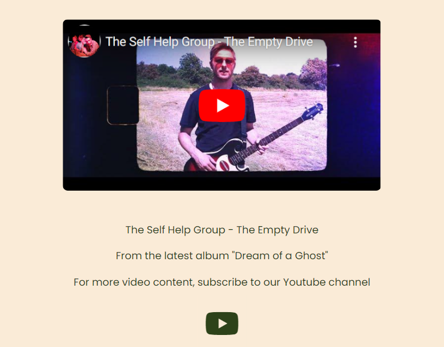
- _Ghost of a Dream album cover and streaming links_
    - Featured on the stream page, the user is welcomed with a picture of the latest album artwork with a message to stream or download now and 3 extra large icons styled with shadow and enlarge, which link directly to the album on Bandcamp, Spotify and Apple Music.
    - This enables the user to link directly to the latest material from the band on their preferred streaming site. Additional sites can be added and the links can be updated for new releases.
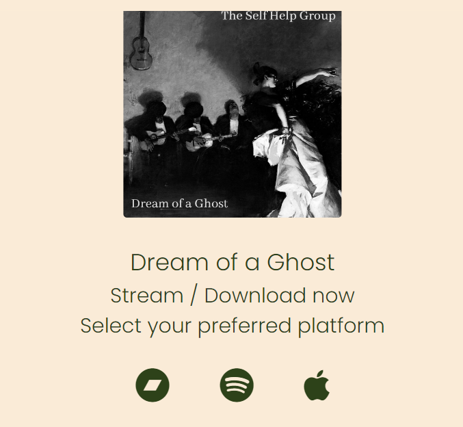

- _Mailing List sign up_
    - Featured on the Shows page a simple form for the user to enter their email address to receive information about future shows in their inbox, the email entry field is a wide box to catch the eye  and the submit button which has the site wide hover styling and additionally has a solid border to make it stand out to the user as a call to action.
    - This feature enables users to be kept up to date about upcoming shows, it can be especially useful to users who do not frequent the social media platforms which the band uses and updates most frequently. It provides another means for the band to reach out to and interact with it's fanbase, about merchandise, new releases and shows.
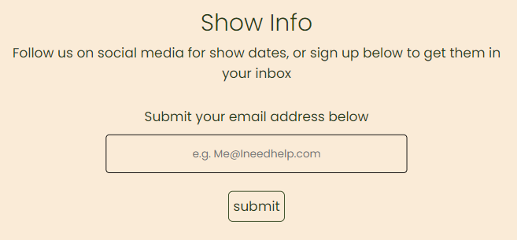
- _Gallery_
    - Featured on the Shows page the gallery shows a number of black and white images of the band in action on various stages in different settings. The purpose of the content is to encourage the user to attend a live show,
    - This feature enables the user to enjoy pictures of the band in various venues and locations. The pictures can be updated to stay current.
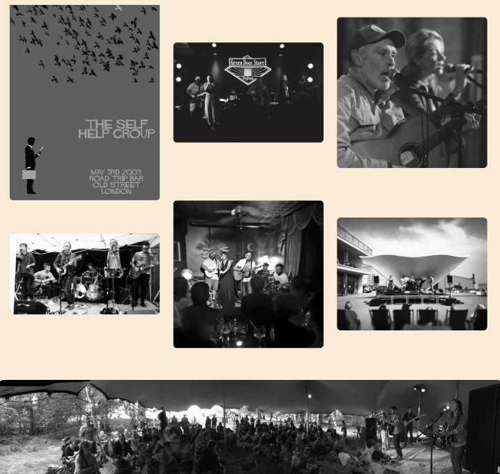
- _Contact Form_
    - Featured on the Contact page, which is branched off of the main site content, reached by clicking the "Contact Us" link located in the footer. This simple contact form is validated requiring name, email and message fields all to be filled in. The submit button is styled with the additional border to match the submit button for the mailing list form.
    - This feature enables the user to contact the band. Useful to those who wish to enquire about bookings, availability, or media queries amongst others.
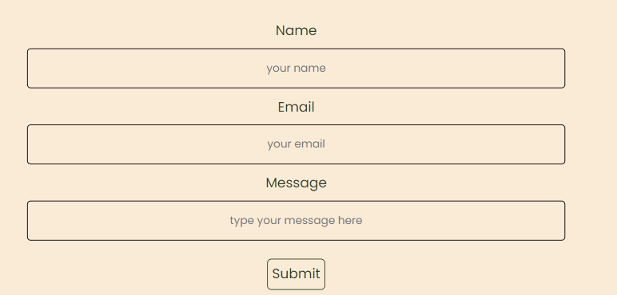
- _Contact Confirmation_
    - Featured on the contactconfirm page, which is branched off of the main site content. It is accessed when a user submits a valid contact form enquiry, lets the user know their message has been received and includes all of the usual links back to the main site so the user can continue browsing
    - The user gains confirmation that their message submit has been succesful and are reassured that their enquiry will receive a response soon.
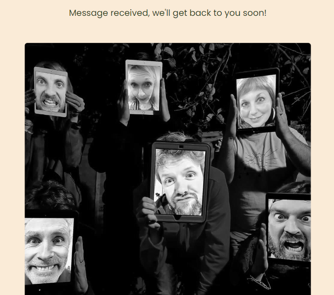
- _Audio Player_
    - Featured on the mailinglist confirmation page this is intended as an Easter Egg reward for signing up to the mailing list, it features the track "The Make Believe Band" from the new album as bonus content. The player is responsive to screen size and the user has full control over playback. It is followed with a pixelated selfie of the band and a thank you message.
    - This feature allows the user to hear another track from the band without leaving the site, its location is a pleasant unexpected surprise. Listening to this additional music whilst being encouraged to scroll by the selfie picture will encourage the user to click the footer links to streaming and social media.
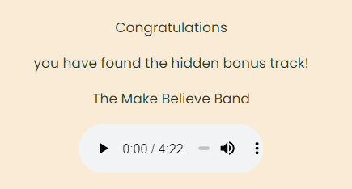
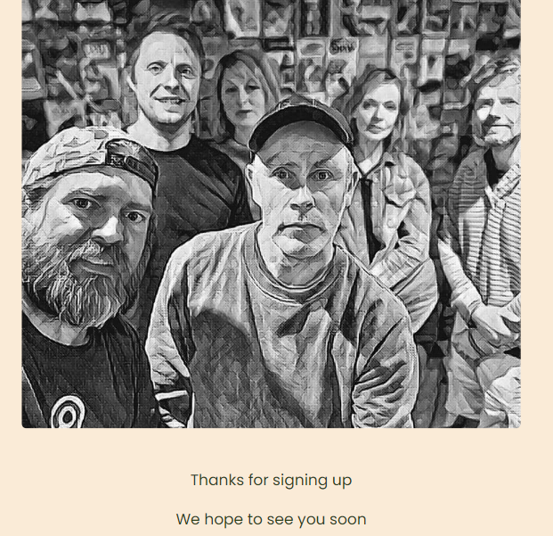
- _Custom 404 page_
    - This feature gives an error message on a page styled in the theme of the rest of the site, with a link to get the user back to the main landing page. Useful to users who follow a broken link or if they encounter some other error, they can get back to the main site easily.
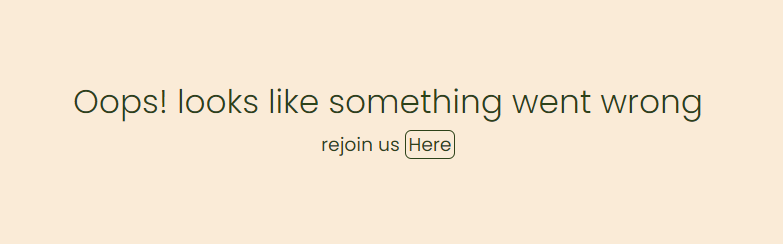
### Features Left To Implement
    - The gallery section is hard to see on small screens without using pinch actions, click to fullscreen would be valuable for users to fully enjoy the images.
    - A functioning onsite store where users can buy merchandise and music direct from the band.
## Development and Testing
-   Testing and Development documentation can be found on the following link

