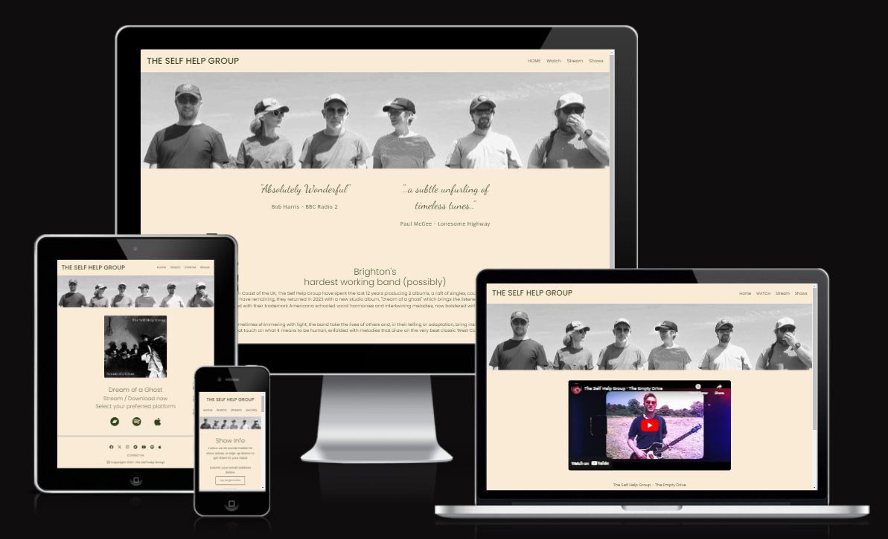

# The Self Help Group
Find the deployed site [Here](https://codebystu.github.io/msp1-tshg-final)

Testing was carried out throughout the development of the site, all visual components and layout design were viewed on a variety of screen sizes before during and after styling using Google Dev Tools in the Chrome browser, and following the completion of each page further testing was carried out on Firefox and Edge on my laptop and Safari on an iphone 11, iphone 6s and ipad air 2, both for a visual check of layout and to test all feature and link functionality. I dont have access to any android devices so sent site link to a friend with a Samsung phone, who reported no broken links or obvious visual errors.
Automated testing was carried out using a variety of web applications.
## Manual Testing
### Feature Tests
#### Navbar
| Feature | Action | Expected Result | Actual Result |
| --- | --- | --- | --- |
| Logo | Click Logo | Load / refresh Home page | Home page loaded / refreshed |
| Menu link uppercase on active page | Navigate to each page and check | Active page will be uppercase on Home Watch Stream and Shows pages and no uppercase menu items on landing pages for forms and submissions | Correct uppercase manu item on main menu pages, off menu pages show no uppercase menu items |
| Menu item shadow on hover over | Hover over each menu item | Shadow should appear below each single menu item to highlight | Shadow appears below each single item when hovered, disappears when hover ends |
| Each menu link navigates to correct target | Click on link | Target page loads / refreshes | Target page loads / refreshes for all links |
#### Banner Image
| Feature | Action | Expected Result | Actual Result |
| --- | --- | --- | --- |
| Message overlay on banner image | Hover over image | Message is revealed on hover and disappears when hover ends | Message is revealed hover and disappears when hover ends |
| Message link | Hover then click | On hover shadow should appear to highlight as link, on click target page should load| Shadow appears on hover, click loads target page|
#### Footer
| Feature | Action | Expected Result | Actual Result |
| --- | --- | --- | --- |
| Social media icons resposive styling | Hover over | Each icon should enlarge slightly and be highlighted with a shadow | Each icon enlarges slightly and has a shadow |
| Social media icons as links | Click on link | Open new window with the bands landing page on each platform | New window opens with the bands landing page on each platform |
| Contact us form link | Hover over | Shadow added to link | Shadow appears |
| Contact us form link | Click on link | Loads Contact form | Contact form loaded |
#### Media Players
| Feature | Action | Expected Result | Actual Result |
| --- | --- | --- | --- |
| Video player | On loading | Loads up with target video, does not autoplay, user has control | Loads up with target video, does not autoplay, user has control |
| Video player fullscreen | Click on fullscreen icon on video player | Video launched in fullscreen mode, second click returns to normal size | Video launches in fullscreen mode, second click returns to normal size |
| Video player plays content | Click play on video | Video plays with sound | Video plays with sound |
| Audio player | On loading | Loads up with correct audio file, does not autoplay, user controls available | Loads up with correct audio file, does not autoplay, user controls available |
| Audio Player playback | Click Play | Audio file plays | Audio file plays |
#### Large Streaming Site Icons (Stream page)
| Feature | Action | Expected Result | Actual Result |
| --- | --- | --- | --- |
| Large icon links to current album stream / download on each platform | Click on link | Platform opens in new window on the album page not the bands landing page | Platform opens in new window on the album page not the bands landing page |
#### Alternative Banner Message Shows on page
 | Feature | Action | Expected Result | Actual Result |
| --- | --- | --- | --- |
| Alternative message on banner image overlay | Hover over image | Message shows next show info with link to venue website | Message shows next show info with link to venue website |
| Link to venue website | Click on link | Venue website opens in new window | Venue website opens in new window |
#### Show Info Sign Up Form
| Feature | Action | Expected Result | Actual Result |
| --- | --- | --- | --- |
| Form validation | Enter non email text and submit | Receive prompt to enter valid email in box | Prompt appears to enter valid email |
| Form validation | Enter valid email and submit | Loads mailinglist.html page | Loads mailinglist.html page |
#### Contact Form
| Feature | Action | Expected Result | Actual Result |
| --- | --- | --- | --- |
| Form validation | Submit invalid data on form | Prompt appears for each field where invalid entry has been made | Prompt appears for each field where invalid entry has been made |
Form validation | Submit valid data on form | contactconfirm.html page loads | contactconfirm.html page loads |
### Visual Tests
#### Screen Size Responsive Elements
| Feature | Action | Expected Result | Actual Result |
| --- | --- | --- | --- |
| Banner message | View on smaller screen sizes | Text resizes and remains within the banner image area | Text resizes and remains within the banner image area |
| Big quotes | View on smaller screen sizes | Text resizes and does not bleed into History section | Text resizes and does not bleed into History section |
| Gallery | View on smaller screen sizes | Number of columns reduce to 2 on medium screens and 1 on small screens | Number of columns reduce to 2 on medium screens and 1 on small screens |
| Navbar / Header | View on smaller screen sizes | Menu drops below Logo and aligns center, banner image not covered by header | Menu drops below Logo and aligns center, banner image not covered by header |

## Automated Testing
### Accessibility
#### Colour Scheme
Colour contrast tested using [Coolors](https://coolors.co/contrast-checker/2d4219-faebd7) scoring a ratio of 9.41 well above the AAA rating of 7:1 ratio.
#### Screen Readers
[WAVE](https://wave.webaim.org/report#/https://codebystu.github.io/msp1-tshg-final/index.html) reports no accessibility issues across the site, with aria labelling and alt text present where required.
### Lighthouse Performance
#### Initial Tests
Initial testing for performance on Lighthouse showed scores above 90% for all 4 main pages,  [Home](documents/testing/lighthouse/homedt1.png), [Watch](documents/testing/lighthouse/watchdt1.png), [Stream](documents/testing/lighthouse/streamdt1.png) and [Shows](documents/testing/lighthouse/streamdt1.png) on desktop devices. Mobile device test scores showed degraded performance due to initial load time of images, with the  gallery on the shows page reducing performance to just 60% [Home](documents/testing/lighthouse/homemobile1.png) [Watch](documents/testing/lighthouse/watchmobile1.png) [Stream](documents/testing/lighthouse/streammobile1.png) [Shows](documents/testing/lighthouse/showsmobile1.png). I still needed to apply aria labelling and alt test to links and images resulting in lower scores for accessibility across all pages. 
#### Suggested Fixes
- Compress all images
- Add aria labelling to links
- Add alt text to images
#### Results Following Implementation
Post implementation all scores improved across all devices except Best Practice on the Watch page which remained at 78% due to third party cookies being present in the code of the embedded video from YouTube, over which I have no control.
Final test results can be seen below
- _Desktop_
    - [Home](documents/testing/lighthouse/homedt2.png)
    - [Watch](documents/testing/lighthouse/watchdt2.png)
    - [Stream](documents/testing/lighthouse/streamdt2.png)
    - [Shows](documents/testing/lighthouse/showsdt2.png)
    - [Contact Form](documents/testing/lighthouse/contactdt.png)
    - [Contact Confirmation](documents/testing/lighthouse/ccdt.png)
    - [Mailing List](documents/testing/lighthouse/mailingdt.png)
- _Mobile_
     - [Home](documents/testing/lighthouse/homemob2.png)
    - [Watch](documents/testing/lighthouse/watchmob2.png)
    - [Stream](documents/testing/lighthouse/streammob2.png)
    - [Shows](documents/testing/lighthouse/showsmob2.png)
    - [Contact Form](documents/testing/lighthouse/contactmob.png)
    - [Contact Confirmation](documents/testing/lighthouse/ccmob.png)
    - [Mailing List](documents/testing/lighthouse/mailingmob.png)
### W3Validator HTML
   - All pages pass [W3Validation](https://validator.w3.org/nu/?doc=https%3A%2F%2Fcodebystu.github.io%2Fmsp1-tshg-final%2F) with no errors.
### Jigsaw Validator CSS
 - No errors found in CSS by [Jigsaw Validation](https://jigsaw.w3.org/css-validator/validator?uri=http%3A%2F%2Fcodebystu.github.io%2Fmsp1-tshg-final&profile=css3svg&usermedium=all&warning=1&vextwarning=&lang=en)

## Bugs
| Bug | Cause | Fix Applied | Fix Succesful? |
| --- | --- | --- | --- |
| Banner overlay, not aligned with the image | Incorrect use of `position: relative` | use `position: absolute` | yes |
| Big quotes bleeding into History section on smaller screens | Not enough media query breakpoints identified | Manual resizing of screen to find additional breakpoints required | yes |
| Menu bleeding into banner image on smaller screens following renaming of menu items | new menu names have additional and wider characters causing overflow | alter positioning parameters in CSS code | yes |

## Software Limitation
Not a bug more of a preference. The standard HTML audio player allows the .mp3 file to be downloaded on Chrome and Edge, the download option is not present on Firefox or Safari. I didn't check other browsers. The only fix I could find using only HTML and CSS was to add `controlsList="nodownload"` to the audio element in the HTML code.  This solves the issue on both Chrome and Edge but the code fails W3validation with this included as it is not supported across many browsers.  I have noted this in the HTML on the relevant page as a TODO, so I can revisit it when I find a solution.